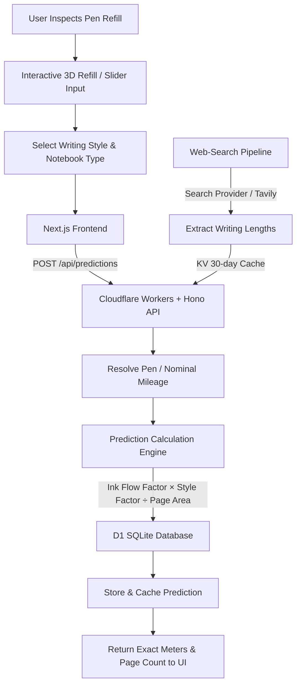

# മഷി ഉണ്ടോ മാഷേ ? (Mashi Undo Mashe?) 🎯

## Basic Details
### Team Name: U NEt

### Team Members
- Member 1: Adithyan U P - College of Engineering Attingal
- Member 2: Harigovind P Nair - College of Engineering Attingal

### Project Description
A playful, hyper-accurate stationery-tech application and interactive 3D pen visualizer that calculates exactly how many pages and meters of writing your pen has left based on its visible refill level, ink viscosity, writing pressure, and notebook format.

### The Problem (that doesn't exist)
The existential dread of sitting in an exam hall or meeting, squinting through a translucent pen barrel against a tube light, desperately guessing whether that remaining 1.2 cm of ink will survive essay question #3 or suddenly dry out mid-sentence.

### The Solution (that nobody asked for)
**"മഷി ഉണ്ടോ മാഷേ ?"** brings over-engineered ink fluid dynamics to stationery! Drag an interactive 3D refill slider to match your visible ink, pick your pen model, writing style (light, normal, heavy), and notebook size (Long Book, Queen Book, King Book), and our prediction engine calculates your remaining writing distance in meters and exact pages remaining down to the decimal.

---

## Technical Details

### Technologies/Components Used

#### For Software:
- **Languages:** TypeScript, JavaScript, SQL
- **Frameworks:** Next.js 16 (App Router), Hono v4 (Cloudflare Workers)
- **Libraries:**
  - 3D Visualizer: Three.js, React Three Fiber (`@react-three/fiber`, `@react-three/drei`)
  - Animations & UI: Framer Motion, Tailwind CSS v4, Lucide React
  - Data & Validation: Drizzle ORM, Zod, `@tanstack/react-query`
- **Tools & Infrastructure:**
  - Runtime: Cloudflare Workers
  - Database: Cloudflare D1 (Distributed SQLite)
  - Caching & Rate-limiting: Cloudflare KV (30-day cache)
  - Tooling: Wrangler v3, tsx, Drizzle Kit

#### For Hardware:
- *N/A (Pure Software / Web Application)*

---

### Implementation

#### For Software:

```bash
# 1. Clone the repository
git clone https://github.com/hari2629-p/Unet2.0.git
cd Unet2.0

# 2. Setup & Run the Cloudflare Backend API
npm install
npm run db:migrate:local
npm run db:seed:local
npm run dev

# 3. Setup & Run the Next.js Frontend
cd frontend
npm install
npm run dev
```

The app will be live at:
- **Frontend App:** `http://localhost:3000`
- **Backend API & Swagger Docs:** `http://localhost:8787/api/docs`

---

### Project Documentation

#### For Software:

# Screenshots

*1. Interactive 3D Refill & Ink Estimator — Drag the 3D refill or slider to set visible ink level (0–100%) with real-time feedback.*


*2. Accurate Page Yield Calculator — Breakdown of remaining distance (meters) and pages across Long Book, Queen Book, and King Book.*


*3. Automated Pen Claim Discovery — Web-search pipeline discovering manufacturer write-out specs with 30-day KV cache.*

# Diagrams

*Architecture and calculation workflow of the InkLife prediction system.*

---

## Team Contributions
- **Adithyan U P**: Frontend UI/UX, interactive 3D pen refill model & controller integration with Three.js / React Three Fiber, custom nib cursor styling, and responsive layout animations.
- **Harigovind P Nair**: Backend Cloudflare Workers & Hono API architecture, D1 SQLite database schema & Drizzle ORM, core mathematical prediction engine, and web search lookup pipeline.

---
Made with ❤️ at TinkerHub Useless Projects 


